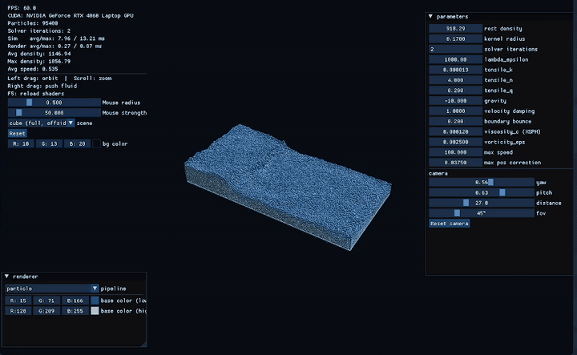

# water-sim2

Real-time 3D Position Based Fluids on the GPU. The simulation runs as CUDA
kernels, OpenGL draws the result, and the two share the particle buffers through
CUDA–GL interop, so nothing round-trips through the host.



95,400 particles at 60 FPS on an RTX 4060 Laptop GPU: about 7.6 ms of simulation
and 0.3 ms of rendering per frame, with two solver iterations.

## What it does

- **Position Based Fluids** (Macklin & Müller, 2013): predicted positions, a
  density constraint solved with Jacobi iterations, the tensile-instability
  correction, vorticity confinement, and XSPH viscosity.
- **Spatial-hash neighbor search.** Particles are hashed into a uniform grid,
  sorted by cell with `thrust::sort_by_key`, and reordered into cell order so
  neighbor traversal reads coalesced memory instead of gathering.
- **Interaction.** Left-drag orbits the camera, scroll zooms, right-drag pushes
  the fluid along a ray from the cursor.
- **Two render pipelines**, switchable at runtime: point-sprite particles
  colored by density, and a screen-space pipeline that draws depth-correct
  sphere impostors as the first stage of a surface renderer.
- **Live tuning.** A Dear ImGui panel exposes every solver parameter (rest
  density, kernel radius, iterations, tensile terms, viscosity, vorticity,
  damping) and shows per-frame simulation and render timings. F5 reloads the
  shaders without restarting.
- **Scenes** (cube, offset cube, column, blocks), selectable from the panel.

## Building

Requires a CUDA toolkit, an OpenGL 4.5 driver, GLEW, and CMake 3.24 or newer.
GLFW, GLM, Dear ImGui, and nlohmann/json are fetched by CMake.

```sh
cmake -B build
./build.sh
./run.sh
```

Two things to know before building on another machine:

- `CMAKE_CUDA_ARCHITECTURES` is pinned to 89 (Ada Lovelace) in
  `CMakeLists.txt`. Change it to match your GPU.
- `run.sh` forces OpenGL onto the NVIDIA GPU through PRIME render offload.
  Hybrid-graphics laptops need this for CUDA–GL interop, since the X server
  otherwise picks the integrated GPU. NVCC 13.2 cannot use GCC 16's headers, so
  the build pins `g++-15` as the CUDA host compiler when it is present.

## Controls

| Input | Action |
|---|---|
| Left drag | Orbit camera |
| Scroll | Zoom |
| Right drag | Push fluid |
| F5 | Reload shaders |

## Where it's going

`PLAN.md` is the phased plan, from the 2D prototype through the 3D port to
screen-space fluid rendering with curvature flow. `perf_notes.md` records the
profiling findings that drove the neighbor-search changes.

## References

- Macklin & Müller, *Position Based Fluids*, SIGGRAPH 2013
- Müller et al., *Screen Space Fluid Rendering with Curvature Flow*, I3D 2009
- Hoetzlein, *Fast Fixed-Radius Nearest Neighbors*
- Green, *Particle Simulation using CUDA*, NVIDIA whitepaper

## License

MIT
